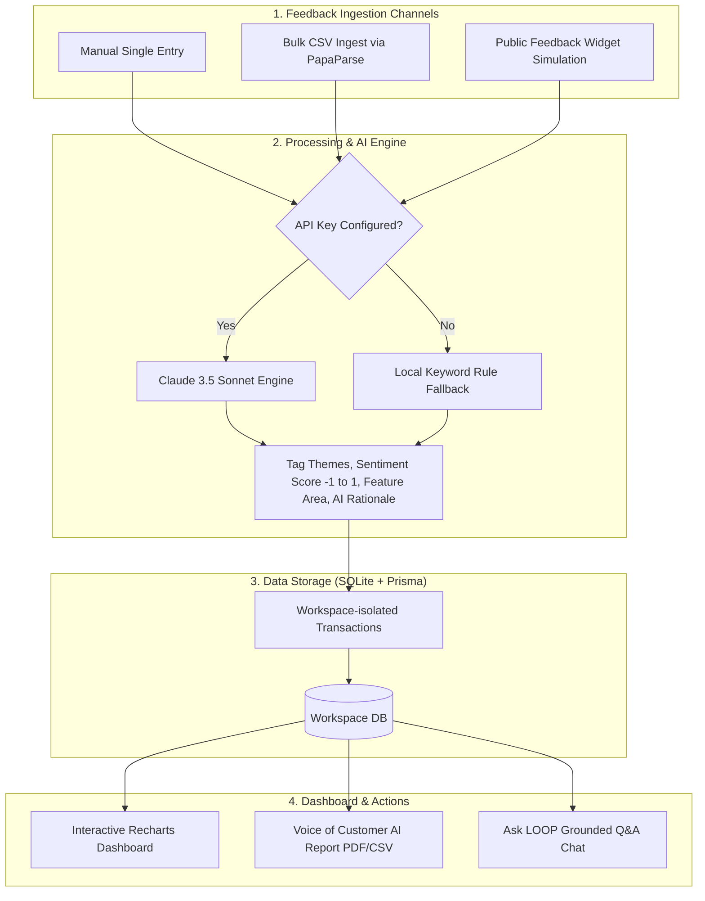
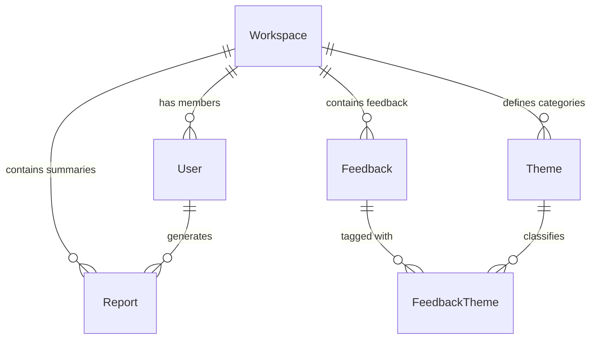

# 🔄 Project LOOP | AI Customer Feedback Intelligence Platform
# 🚀 Project LOOP | AI Customer Feedback Intelligence Platform 

Project LOOP is a modern, multi-tenant B2B SaaS application designed to help companies collect, analyze, and act on customer feedback using AI-powered insights. It transforms raw, unstructured feedback from various channels (such as support tickets, app store reviews, NPS surveys, and sales calls) into actionable intelligence.

This application is built as part of the **Zidio Internship Project Brief**, serving as a hands-on workspace for implementing robust multi-tenant authentication, AI-driven tagging, sentiment analysis, and search.

---

## 📊 System Architecture & Feedback Lifecycle

Below is the workflow showing how feedback is ingested, processed by the AI Engine, stored in the database, and visualised on the dashboard:



---

## 🌟 Key Features

- **🔐 Multi-Tenant Authentication & RBAC**: Secure role-based access control (Admin, Analyst, Viewer) ensuring strict data isolation between workspaces.
- **📊 Analytics Dashboard**: Real-time visualizations of feedback volume, sentiment breakdown, and top themes using interactive charts.
- **📥 Flexible Feedback Ingestion**: 
  - **Manual Single-Entry Form**: Quick manual entry with auto-AI sentiment tagging.
  - **Bulk CSV Import**: Standardized CSV file parser (via PapaParse) to migrate historical feedback data.
  - **Public Widget Simulation**: Simulation of a client-side feedback widget for capturing real-time user experiences.
- **🤖 Ask LOOP (AI Chat)**: Natural language query interface powered by Claude. Ask questions like *"Show me negative feedback about billing"* and get instant, data-backed answers grounded in your feedback.
- **🏷️ AI Themes Engine**: Automatic categorization of feedback into trending topics (e.g., UI/UX, Billing, Performance, Onboarding) with confidence scoring.
- **📈 Comprehensive Reports**: Pre-built, filterable Voice-of-Customer (VoC) reports (7/30/90 days) with one-click CSV export and AI-generated narrative summaries.
- **✨ Premium UI/UX**: Dark-mode optimized, responsive layout with glassmorphism aesthetics, subtle micro-animations, and toast notifications.

---

## 🛠️ Tech Stack & Dependencies

| Layer | Technology | Details |
| :--- | :--- | :--- |
| **Framework** | Next.js 16 (App Router) | React Server Components, Client components, and API routes. |
| **Language** | TypeScript | Type safety across API endpoints and client components. |
| **Styling** | Tailwind CSS v4 & PostCSS | Premium dark-themed, glassmorphic layout. |
| **Database** | SQLite | Fast local file-based database. |
| **ORM** | Prisma | Schema migration, query generation, and seeding. |
| **Authentication** | NextAuth.js (v4) | Credentials provider authentication flow. |
| **AI SDK** | `@anthropic-ai/sdk` | Integration with Claude 3.5 Sonnet (`claude-3-5-sonnet-20241022`) for report generation and chat Q&A. |
| **Data Tools** | PapaParse | Client-side CSV parser for data ingestion. |
| **Visualization** | Recharts | Interactive and animated chart components. |
| **Notifications** | Sonner | Real-time elegant toast messages. |

---

## 📂 Project Architecture & Directory Layout

```text
├── app/                      # Next.js App Router root
│   ├── (auth)/               # Authentication route group (login, signup)
│   ├── (dashboard)/          # Secured dashboard route group
│   │   ├── ask/              # Ask LOOP (AI Q&A Chat page)
│   │   ├── dashboard/        # Dashboard Analytics charts & summary
│   │   ├── inbox/            # Feedback list & single submission page
│   │   ├── reports/          # Voice of Customer report generation page
│   │   ├── settings/         # Workspace / Account configuration pages
│   │   └── themes/           # AI Themes list & categorization page
│   ├── api/                  # Backend REST API routes (auth, feedback, etc.)
│   ├── globals.css           # Global CSS styles including custom Tailwind layer
│   ├── layout.tsx            # Global layout configuration
│   └── page.tsx              # Landing / Welcome Page
├── components/               # Modular & reusable components
│   ├── layout/               # Sidebar and Navbar layouts
│   └── ClientProvider.tsx    # Global SessionProvider wrapper
├── lib/                      # Business logic utilities
│   ├── ai.ts                 # Anthropic SDK setup and AI helper functions (Claude integration)
│   ├── auth.ts               # NextAuth setup and configuration
│   ├── db.ts                 # Database client instantiation (Prisma Client)
│   └── search.ts             # Keyword search and matching algorithms
├── prisma/                   # Database files
│   ├── schema.prisma         # Prisma database schema definition
│   ├── seed.ts               # Local seeding script with demo workspace & feedback data
│   └── dev.db                # SQLite database file
├── types/                    # Core TypeScript custom interfaces and enums
└── middleware.ts             # Route protection middleware for secured dashboard paths
```

---

## 🗄️ Database Schema & Relationships

The database is built on SQLite. It structures workspaces, users, themes, feedback items, and VoC reports.



### Database Model Fields

#### 1. `Workspace` (Multi-tenant company/organization container)
| Column | Type | Keys/Constraints | Description |
| :--- | :--- | :--- | :--- |
| `id` | `String` | Primary Key, `cuid()` | Unique identifier for the organization workspace. |
| `name` | `String` | - | Company or tenant name. |
| `createdAt` | `DateTime` | Default `now()` | Registration timestamp. |
| `updatedAt` | `DateTime` | Auto-updated | Modification timestamp. |

#### 2. `User` (Team members with roles)
| Column | Type | Keys/Constraints | Description |
| :--- | :--- | :--- | :--- |
| `id` | `String` | Primary Key, `cuid()` | Unique user identifier. |
| `name` | `String` | - | Full name of the user. |
| `email` | `String` | Unique index | Login credential email. |
| `passwordHash`| `String` | - | Clear text or hashed credential store. |
| `role` | `String` | Default `"VIEWER"` | Access permissions role: `ADMIN`, `ANALYST`, or `VIEWER`. |
| `workspaceId` | `String` | Foreign Key -> `Workspace` | Tenant organization pointer. |
| `createdAt` | `DateTime` | Default `now()` | Registration timestamp. |
| `updatedAt` | `DateTime` | Auto-updated | Modification timestamp. |

#### 3. `Feedback` (Customer feedback records)
| Column | Type | Keys/Constraints | Description |
| :--- | :--- | :--- | :--- |
| `id` | `String` | Primary Key, `cuid()` | Feedback unique entry ID. |
| `content` | `String` | Text content | Raw customer feedback text. |
| `channel` | `String` | Index (Workspace-isolated) | Source channel, e.g., `SUPPORT_TICKET`, `APP_STORE`, etc. |
| `sourceRef` | `String?` | Optional | Ticket number or app store ID reference. |
| `customerLabel`| `String?`| Optional | Segmentation category, e.g. "Enterprise", "Free Tier". |
| `sentiment` | `String` | Default `"NEUTRAL"`, Index | Computed sentiment value: `POSITIVE`, `NEUTRAL`, or `NEGATIVE`. |
| `sentimentScore`| `Float`| Default `0.0` | Range from `-1.0` (critical) to `1.0` (highly positive). |
| `featureArea` | `String?` | Optional | Classified category like "Checkout", "Onboarding". |
| `aiRationale` | `String?` | Optional | Explanation for classification computed by Claude. |
| `status` | `String` | Default `"NEW"`, Index | Workspace flow: `NEW`, `REVIEWED`, `ACTIONED`. |
| `workspaceId` | `String` | Foreign Key -> `Workspace` | Tenant workspace validation. |
| `createdAt` | `DateTime` | Default `now()`, Index | Custom insertion timestamp. |
| `updatedAt` | `DateTime` | Auto-updated | Last updated timestamp. |

#### 4. `Theme` (AI-discovered topics/categories)
| Column | Type | Keys/Constraints | Description |
| :--- | :--- | :--- | :--- |
| `id` | `String` | Primary Key, `cuid()` | Theme unique identifier. |
| `name` | `String` | Unique per Workspace | Category name, e.g. "Billing", "UI/UX". |
| `description` | `String?` | Optional | Purpose of the category theme. |
| `color` | `String` | Default `"#6366f1"` | Hex color string code used in frontend tags. |
| `workspaceId` | `String` | Foreign Key -> `Workspace` | Organization indicator. |
| `createdAt` | `DateTime` | Default `now()` | theme discovery timestamp. |
| `updatedAt` | `DateTime` | Auto-updated | Theme updated timestamp. |

#### 5. `FeedbackTheme` (Many-to-Many Join Table)
| Column | Type | Keys/Constraints | Description |
| :--- | :--- | :--- | :--- |
| `feedbackId` | `String` | Primary Key, FK -> `Feedback` | Feedback pointer. |
| `themeId` | `String` | Primary Key, FK -> `Theme` | Theme category pointer. |
| `confidence` | `Float` | Default `1.0` | Confidence scoring range `0.0` to `1.0` computed by AI. |

#### 6. `Report` (Structured Voice-of-Customer AI Reports)
| Column | Type | Keys/Constraints | Description |
| :--- | :--- | :--- | :--- |
| `id` | `String` | Primary Key, `cuid()` | Report unique identifier. |
| `title` | `String` | Text content | Title heading of the generated report. |
| `periodStart` | `DateTime` | - | Query filter start date boundary. |
| `periodEnd` | `DateTime` | - | Query filter end date boundary. |
| `contentJson` | `String` | JSON payload string | Markdown payload generated by AI Sonnet model. |
| `workspaceId` | `String` | Foreign Key -> `Workspace` | Organization pointer. |
| `generatedById`| `String`| Foreign Key -> `User` | The analyst/admin user who requested the report. |
| `createdAt` | `DateTime` | Default `now()`, Index | Report creation timestamp. |
| `updatedAt` | `DateTime` | Auto-updated | Modification timestamp. |

---

## 🌐 Next.js Backend API Reference

All routes require a valid active session via NextAuth session tokens (enforced by middleware or endpoint checks) and validate requests against `workspaceId`.

| Method | Endpoint | Description | Expected Payload (JSON) | Access Role |
| :--- | :--- | :--- | :--- | :--- |
| **POST** | `/api/signup` | Creates a new tenant workspace and admin user. | `{ name, email, password, companyName }` | Public |
| **GET** | `/api/feedback` | Fetches filtered, paginated feedback list. | *Query Parameters (status, sentiment, search, page)* | All roles |
| **POST** | `/api/feedback` | Manually submits a feedback log and classifies it. | `{ content, channel, sourceRef, customerLabel }` | Admin / Analyst |
| **POST** | `/api/feedback/bulk` | Deletes or updates statuses/themes of multiple items. | `{ ids: String[], action: "delete" \| "status", value?: String }` | Admin / Analyst |
| **POST** | `/api/feedback/import` | Uploads parsed array of feedbacks from a CSV. | `{ feedbacks: Array<{ content, channel, ... }> }` | Admin / Analyst |
| **GET** | `/api/feedback/[id]` | Retrieves details for a specific feedback log. | - | All roles |
| **PATCH** | `/api/feedback/[id]` | Modifies status or manually adjusts theme classifications. | `{ status?: String, themes?: String[] }` | Admin / Analyst |
| **DELETE** | `/api/feedback/[id]` | Deletes a single feedback record. | - | Admin |
| **GET** | `/api/themes` | Lists all discovered themes and their feedback counters. | - | All roles |
| **POST** | `/api/themes` | Adds a new classification theme manually. | `{ name, description, color }` | Admin / Analyst |
| **GET** | `/api/insights` | Fetches aggregate analytics counters and historical trends. | *Query Parameters (days)* | All roles |
| **POST** | `/api/ask` | Submits natural language question to Ask LOOP chat. | `{ question: String }` | All roles |
| **GET** | `/api/reports` | Lists previously generated VoC reports. | - | All roles |
| **POST** | `/api/reports` | Generates a new VoC report using AI Sonnet logic. | `{ title, periodStart, periodEnd }` | Admin / Analyst |

---

## ⚙️ Local Setup Instructions

Follow these instructions to run the application on your local machine:

### 📋 Prerequisites
- **Node.js** (v18+ recommended)
- **npm** (v9+ recommended)
- **Anthropic Claude API Key** (optional - fallback local summaries will be generated if not provided)

### 🚀 Step-by-Step Installation

1. **Clone the repository**:
   ```bash
   git clone <your-repo-url>
   cd AI_Customer_Feedback_Platform
   ```

2. **Install Dependencies**:
   ```bash
   npm install
   ```

3. **Configure Environment Variables**:
   Copy `.env.example` to `.env` and fill in the values:
   ```bash
   cp .env.example .env
   ```
   *Note: For local development, the default database URL is already set to `file:./dev.db` which is SQLite compatible.*

4. **Initialize Database and Seed Demo Data**:
   Ensure you run the Prisma migrations and seed the SQLite database with 125 feedback variations, themes, and test credentials:
   ```bash
   npx prisma migrate dev --name init
   npx prisma db seed
   ```

5. **Start the Development Server**:
   ```bash
   npm run dev
   ```
   The application will be running at [http://localhost:3000](http://localhost:3000).

---

## 🔑 Seeding & Default Credentials

For testing purposes, the seed script (`prisma/seed.ts`) populates the database with a default workspace named **"Acme Corp Demo"** and three users. You can sign in using any of the following credentials:

| Role | Email Address | Password | Permissions |
| :--- | :--- | :--- | :--- |
| **Admin** | `amit@acme.com` | `hashed_password_123` | Full access, settings modification, database ingestion. |
| **Analyst** | `analyst@acme.com` | `hashed_password_123` | View data, edit feedback tagging, generate reports. |
| **Viewer** | `viewer@acme.com` | `hashed_password_123` | Read-only access to dashboard and analytics. |

---

## 🤖 AI Logic & Fallback Mechanics

Project LOOP utilizes **Anthropic's Claude 3.5 Sonnet** (`claude-3-5-sonnet-20241022`) to process feedback data.

- **Reports Generation**: Analyzes historical feedback statistics, sentiment distribution, and customer quotes to generate a structured markdown report consisting of an Executive Summary, themes critique, and strategic action plans.
- **Ask LOOP Chat**: An interactive chat prompt where your database feedback logs are injected as grounding context to provide factual answers to inquiries.
- **Local Fallback Mode**: If `ANTHROPIC_API_KEY` is not provided in your `.env` file, the platform automatically switches to local rules-based keywords processing and pre-defined VoC templates so that the core user flows can still be tested and evaluated without API costs.

---

## 📝 Available Scripts

Use the following scripts to interact with the project:

- `npm run dev`: Starts the Next.js development server.
- `npm run build`: Bundles the Next.js application for production.
- `npm run start`: Runs the production-built next server.
- `npm run lint`: Validates the codebase style using ESLint.
- `npx prisma studio`: Opens an interactive GUI in the browser to view/edit database entries.
- `npx prisma db seed`: Re-seeds the database with test feedback.